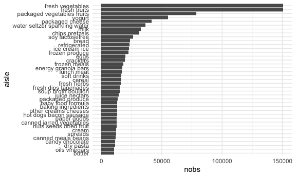
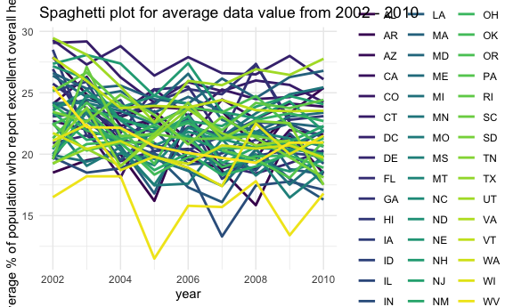
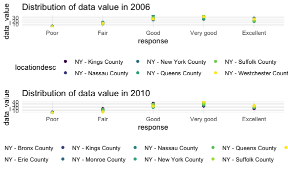
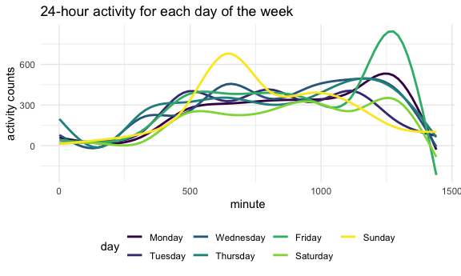

p8105\_hw3\_fl2569
================
Fang Liu
10/15/2021

``` r
library(tidyverse)
library(gridExtra)
library(readr)

#figure size options
knitr::opts_chunk$set(
  fig.width = 6,
  fig.asp = .6,
  out.width = "90%"
)

#set theme settings
theme_set(theme_minimal() + theme(legend.position = "bottom"))

options(
  ggplot2.continuous.colour = "viridis",
  ggplot2.continuous.fill = "viridis"
)

scale_colour_discrete = scale_colour_viridis_d
scale_fill_discrete = scale_fill_viridis_d
```

## Problem 1

This problem uses the instacart data.

``` r
library(p8105.datasets)
data(instacart)
```

Write a short description of the dataset, noting the size and structure
of the data, describing some key variables, and giving illustrative
examples of observations.

``` r
str(instacart)
head(instacart)
summary(instacart)
```

The `instacart` dataset has **1384617** rows and **15**
columns/variables. Key variables include: order\_id, product\_id,
user\_id, days since the last order, product\_name, and the department
and aisle of that product.

#### How many aisles are there, and which aisles are the most items ordered from?

``` r
aisle_rank =
  instacart %>% 
  janitor::tabyl(aisle) %>% 
  select(aisle, n) %>% 
  arrange(desc(n)) 
```

There are 134 distinct aisles and most items are ordered from the fresh
vegetables(150,609), fresh fruits (150,473), and packaged vegetables
fruits (78,493) section.

#### Make a plot that shows the number of items ordered in each aisle, limiting this to aisles with more than 10000 items ordered.

``` r
instacart %>% 
  group_by(aisle) %>% 
  summarise(
    nobs = n()
  ) %>% 
  filter(nobs > 10000) %>% 
  mutate(aisle = fct_reorder(aisle, nobs)) %>% 
  ggplot(aes(x = aisle, y = nobs)) +
  geom_bar(stat = "identity") + 
  coord_flip() 
```


From the above plot, we see that most items ordered are from the fresh
vegetables, fresh fruits, and the packaged vegetables fruits aisle.

#### Make a table showing the three most popular items in each of the aisles “baking ingredients”, “dog food care”, and “packaged vegetables fruits” (include the number of times each item is ordered).

``` r
popular_items =
instacart %>% 
  drop_na() %>% 
  filter(aisle %in% c("baking ingredients", "dog food care", "packaged vegetables fruits")) %>% 
  group_by(aisle) %>% 
  count(product_name, name = 'product_count') %>% 
  mutate(
    product_rank = min_rank(desc(product_count))
  ) %>% 
  filter(product_rank <= 3) %>% 
  arrange(product_rank, .by_group = TRUE) %>% 
  select(-product_rank) %>% 
  knitr::kable() 

popular_items
```

| aisle                      | product\_name                                 | product\_count |
|:---------------------------|:----------------------------------------------|---------------:|
| baking ingredients         | Light Brown Sugar                             |            499 |
| baking ingredients         | Pure Baking Soda                              |            387 |
| baking ingredients         | Cane Sugar                                    |            336 |
| dog food care              | Snack Sticks Chicken & Rice Recipe Dog Treats |             30 |
| dog food care              | Organix Chicken & Brown Rice Recipe           |             28 |
| dog food care              | Small Dog Biscuits                            |             26 |
| packaged vegetables fruits | Organic Baby Spinach                          |           9784 |
| packaged vegetables fruits | Organic Raspberries                           |           5546 |
| packaged vegetables fruits | Organic Blueberries                           |           4966 |

From the table, we see that the top 3 items ordered from the “baking
ingredients” aisle is light brown sugar, pure baking soda, and cane
sugar. The top 3 items from the “dog food care” aisle are snack sticks
chicken & rice, organic chicken & brown rice, and small dog biscuits.
The top 3 items from the “packaged vegetables fruits” aisle are organic
baby spinach, organic raspberries, and organic blueberries.

#### Make a table showing the mean hour of the day at which Pink Lady Apples and Coffee Ice Cream are ordered on each day of the week.

``` r
order_time =
instacart %>% 
  filter(product_name %in% c("Pink Lady Apples", "Coffee Ice Cream")) %>%
  group_by(product_name, order_dow) %>%
  mutate(
    order_dow = case_when(
      order_dow == 0 ~ "Sunday",
      order_dow == 1 ~ "Monday",
      order_dow == 2 ~ "Tuesday",
      order_dow == 3 ~ "Wednesday",
      order_dow == 4 ~ "Thursday",
      order_dow == 5 ~ "Friday",
      order_dow == 6 ~ "Saturday",
      TRUE ~ "other"
    )
  ) %>% 
  summarize(mean_hour = mean(order_hour_of_day)) %>% 
  pivot_wider(names_from = order_dow,
              values_from = mean_hour) %>% 
  select(product_name, Sunday, Monday, Tuesday, Wednesday, Thursday, Friday, Saturday) %>% 
  knitr::kable()

order_time
```

| product\_name    |   Sunday |   Monday |  Tuesday | Wednesday | Thursday |   Friday | Saturday |
|:-----------------|---------:|---------:|---------:|----------:|---------:|---------:|---------:|
| Coffee Ice Cream | 13.77419 | 14.31579 | 15.38095 |  15.31818 | 15.21739 | 12.26316 | 13.83333 |
| Pink Lady Apples | 13.44118 | 11.36000 | 11.70213 |  14.25000 | 11.55172 | 12.78431 | 11.93750 |

We can see from the table that both pink lady apples and the coffee ice
cream are usually ordered around noon to early afternoon(i.e., 11am to
3pm).

## Problem 2

This problem uses the BRFSS data. Load the data from the
`p8105.datasets` package.

#### First, do some data cleaning:

-   format the data to use appropriate variable names  
-   focus on the “Overall Health” topic  
-   include only responses from “Excellent” to “Poor”  
-   organize responses as a factor taking levels ordered from “Poor” to
    “Excellent”

``` r
data("brfss_smart2010")

brfss_df = 
  brfss_smart2010 %>% 
  janitor::clean_names() %>%
  filter(topic == "Overall Health") %>% 
  mutate(response = factor(response, levels = c("Poor", "Fair", "Good", "Very good", "Excellent"))) 
```

#### In 2002, which states were observed at 7 or more locations? What about in 2010?

``` r
#2002
brfss_df %>%
  filter(year == 2002) %>% 
  rename(state = locationabbr) %>% 
  group_by(state) %>% 
  summarize(num_location = length(unique(locationdesc))) %>% 
  filter(num_location >= 7)
```

    ## # A tibble: 6 x 2
    ##   state num_location
    ##   <chr>        <int>
    ## 1 CT               7
    ## 2 FL               7
    ## 3 MA               8
    ## 4 NC               7
    ## 5 NJ               8
    ## 6 PA              10

``` r
#2010
brfss_df %>%
  filter(year == 2010) %>% 
  rename(state = locationabbr) %>% 
  group_by(state) %>% 
  summarize(num_location = length(unique(locationdesc))) %>% 
  filter(num_location >= 7)
```

    ## # A tibble: 14 x 2
    ##    state num_location
    ##    <chr>        <int>
    ##  1 CA              12
    ##  2 CO               7
    ##  3 FL              41
    ##  4 MA               9
    ##  5 MD              12
    ##  6 NC              12
    ##  7 NE              10
    ##  8 NJ              19
    ##  9 NY               9
    ## 10 OH               8
    ## 11 PA               7
    ## 12 SC               7
    ## 13 TX              16
    ## 14 WA              10

In 2002, only **6** states are observed at 7 or more locations (i.e.,
CT, FL, MA, NC, NJ, PA). By 2010, **14** states are observed at 7 or
more locations.

#### Construct a dataset that is limited to Excellent responses, and contains, year, state, and a variable that averages the data\_value across locations within a state.

``` r
new_brfss_df =
brfss_df %>% 
  filter(response == "Excellent") %>% 
  rename(state = locationabbr) %>% 
  group_by(state, year) %>% 
  summarize(mean_value = mean(data_value)) %>% 
  select(year, state, mean_value)

new_brfss_df
```

    ## # A tibble: 443 x 3
    ## # Groups:   state [51]
    ##     year state mean_value
    ##    <int> <chr>      <dbl>
    ##  1  2002 AK          27.9
    ##  2  2003 AK          24.8
    ##  3  2004 AK          23.0
    ##  4  2005 AK          23.8
    ##  5  2007 AK          23.5
    ##  6  2008 AK          20.6
    ##  7  2009 AK          23.2
    ##  8  2002 AL          18.5
    ##  9  2003 AL          19.5
    ## 10  2004 AL          20  
    ## # … with 433 more rows

This give us the average % of respondents in a state who report having
“excellent” general health from 2002 to 2010.

#### Make a “spaghetti” plot of this average value over time within a state (i.e., make a plot showing a line for each state across years).

``` r
new_brfss_df %>% 
  ggplot(aes(x = year, y = mean_value, group = state, colour = state)) +
  geom_line(size = 1) +
  theme(legend.position = "right") + 
  ggtitle("Spaghetti plot for average data value from 2002 - 2010") + 
  ylab("Average % of population who report excellent overall health") 
```


There aren’t any obvious trends in the average % of people who report
having excellent overall health from 2002 to 2010. The % increases for
certain years and decreases for others, also with variations in state.

#### Make a two-panel plot showing, for the years 2006, and 2010, distribution of data\_value for responses (“Poor” to “Excellent”) among locations in NY State.

``` r
plot_06 =
brfss_df %>% 
  rename(state = locationabbr) %>%
  filter(state == 'NY', year == 2006) %>% 
  ggplot(aes(x = response, y = data_value, color = locationdesc)) +
  geom_point() + 
  ggtitle("Distribution of data value in 2006")

plot_10 =
brfss_df %>% 
  rename(state = locationabbr) %>%
  filter(state == 'NY', year == 2010) %>% 
  ggplot(aes(x = response, y = data_value, color = locationdesc)) +
  geom_point() +
  ggtitle("Distribution of data value in 2010")

grid.arrange(plot_06, plot_10)
```


The distribution of data value for the responses among the locations in
NY state stayed relatively the same for 2006 and 2010. Most of the
responses (\~50%) were “good” or “very good” responses. Note that there
are data from three additional counties from NY in 2010, a sign that the
BRFSS survey is more prevalent.

## Problem 3

This problem uses five weeks of accelerometer data collected on a 63
year-old male with BMI 25, who was admitted to the Advanced Cardiac Care
Center of Columbia University Medical Center and diagnosed with
congestive heart failure (CHF).

#### Load & clean the data

``` r
accel_data <- read_csv("data/accel_data.csv")

accel_clean = 
accel_data %>% 
  janitor::clean_names() %>% 
  mutate(day_var = ifelse(day %in% c("Satuday", "Sunday"), "weekend", "weekday")) %>% 
  mutate(day = fct_relevel(day, c("Monday", "Tuesday", "Wednesday", "Thursday", "Friday", "Saturday", "Sunday")))
```

The resulting dataset after tidying has **35** rows/observations and
**1444** columns. Key variables include the week (out of the 5), the
day, activity counts for each minute of that day (24h x 60min/h = 1440
mins), and a variable named `day_var` that indicates whether the day is
a weekday or weekend.

#### Aggregate across minutes to create a total activity variable for each day, and create a table showing these totals. Are any trends apparent?

``` r
accel_clean %>% 
  group_by(day, day_id) %>% 
  summarize(total_activity = sum(activity_1:activity_1440)) %>% 
  knitr::kable()
```

| day       | day\_id | total\_activity |
|:----------|--------:|----------------:|
| Monday    |       2 |       2278.0000 |
| Monday    |       9 |      42486.0000 |
| Monday    |      16 |          1.0000 |
| Monday    |      23 |      38916.0000 |
| Monday    |      30 |          1.0000 |
| Tuesday   |       6 |       3166.2444 |
| Tuesday   |      13 |          1.0000 |
| Tuesday   |      20 |          1.0000 |
| Tuesday   |      27 |        116.0000 |
| Tuesday   |      34 |      20100.0000 |
| Wednesday |       7 |       1126.2000 |
| Wednesday |      14 |          1.0000 |
| Wednesday |      21 |         66.0000 |
| Wednesday |      28 |     386211.0000 |
| Wednesday |      35 |          1.0000 |
| Thursday  |       5 |        941.0444 |
| Thursday  |      12 |     147153.0000 |
| Thursday  |      19 |        528.0000 |
| Thursday  |      26 |      72010.0000 |
| Thursday  |      33 |          1.0000 |
| Friday    |       1 |       3949.2444 |
| Friday    |       8 |     228150.0000 |
| Friday    |      15 |          1.0000 |
| Friday    |      22 |          1.0000 |
| Friday    |      29 |          1.0000 |
| Saturday  |       3 |          1.0000 |
| Saturday  |      10 |       1849.0000 |
| Saturday  |      17 |          1.0000 |
| Saturday  |      24 |          1.0000 |
| Saturday  |      31 |          1.0000 |
| Sunday    |       4 |      46665.0000 |
| Sunday    |      11 |        946.0000 |
| Sunday    |      18 |        715.0000 |
| Sunday    |      25 |          1.0000 |
| Sunday    |      32 |          1.0000 |

There does not seem to be any obvious and consistent trends. For
instance, the patient is very active on certain Mondays (42,486 activity
counts) but not at all on other Mondays(i.e., 1 activity count).
Similarly, the patient is active on 3 Sundays out of the 5 but inactive
on the other two Sundays. Nonetheless, patient does seem to be the least
activity on Saturdays.

#### Make a single-panel plot that shows the 24-hour activity time courses for each day and use color to indicate day of the week

``` r
accel_clean %>% 
  pivot_longer(
  activity_1:activity_1440,
  names_to = "minute",
  names_prefix = "activity_",
  values_to = "activity_count") %>% 
  mutate(minute = as.numeric(minute)) %>%
  ggplot(aes(x = minute, y = activity_count, colour = day)) + 
  geom_smooth(aes(group = day), se = FALSE) +
  ggtitle("24-hour activity for each day of the week") +
  xlab("minute") +
  ylab("activity counts")
```



The patient’s activity gradually increases around the 250th minute and
then starts to plateau starting around the 500th minute (\~8am) and
stays similar till 1000th (\~5pm) minute. Then, we see some increase in
activities and then a steep drop starting around the 1250th minute
(\~9pm), which makes logical sense since the patient is likely getting
ready for bed. From the plot, we also see that the patient is stays up
later then normal on Friday nights and more active on Sunday late
mornings/noon.
